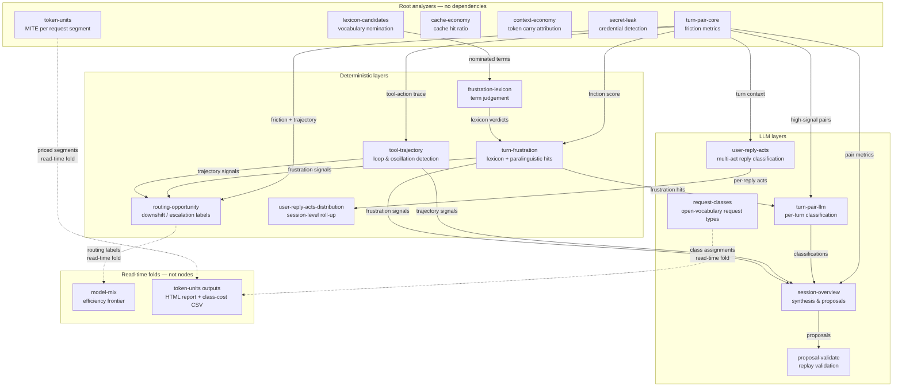

# pi-prospector

[](https://deepwiki.com/elecnix/pi-prospector)

Incremental session analysis and proposal generation for the [Pi coding agent](https://github.com/earendil-works/pi).

pi-prospector reads your Pi and Claude Code session transcripts, indexes them into a local SQLite database, and builds an **append-only analysis graph** over them — measuring every turn deterministically and using an LLM only where the signal warrants it. From that graph it surfaces concrete, ranked proposals to improve your prompts, skills, and configuration. It never applies them. You decide what to develop.

pi-prospector is a Pi **extension**: it has no standalone CLI. Everything runs through slash commands and a `prospect` tool inside a Pi session.

## How it works

```
Pi sessions (~/.pi/agent/sessions/)
        │
        ▼
┌──────────────────────┐
│  /prospect-sync      │  ← Incremental, no LLM. Only new lines are parsed.
│  (fast, cheap)       │    Detects forks; shared message trees stored once.
└────────┬─────────────┘
         │
         ▼
┌──────────────────────┐
│  prospector.db       │  ← Sessions, messages (+FTS), the analysis graph,
│  (SQLite + FTS5)     │    and proposals.
└────────┬─────────────┘
         │
         ▼
┌──────────────────────┐
│  /prospect-analyze   │  ← Builds the analysis graph incrementally:
│                      │
│  turn-pair-core      │    1. Score every turn pair — deterministic.
│     │     │          │
│     ▼     ▼          │    2. turn-pair-llm classifies high-signal turns
│ turn-pair-  tool-    │       (cheap LLM); tool-trajectory finds tool-call
│   llm    trajectory  │       loops & oscillation (deterministic).
│     │     │          │
│     ▼     ▼          │
│  session-overview    │    3. Synthesise → materialise ranked proposals.
└────────┬─────────────┘
         │
         ▼
┌──────────────────────┐
│  proposals table     │  ← status: open / applied / rejected / duplicate.
│  in prospector.db    │    Each links back to the node that justifies it.
└────────┬─────────────┘
         │
         ▼
┌──────────────────────┐
│  Pi tool: prospect   │  ← Your agent lists proposals, accepts or rejects
│  /prospect-* commands│    them, requests syncs, checks stats.
└──────────────────────┘
```

The analysis graph is **append-only and incremental**. Each node records the exact *recipe* that produced it (which analyzer, at which version, under which config, over which inputs), so re-running analysis recomputes only what is genuinely out of date and never repeats expensive LLM work that is still current. See [`DESIGN.md`](./DESIGN.md) for the full model.

## Install

```bash
pi install git:github.com/elecnix/pi-prospector
```

Requires Pi with an LLM API key configured for at least one provider. You choose which models analysis uses (see [Configuration](#configuration)); the deterministic layer needs no model at all.

> **Back up your sessions first.** pi-prospector treats `~/.pi/agent/sessions/` as read-only and never writes to it, but it does not make a backup for you. Run something like `tar czf ~/prospector-backup/sessions-$(date +%Y%m%d).tgz ~/.pi/agent/sessions/` before your first sync.

## Analyzers

Analysis is a small DAG of analyzers. The **deterministic** ones never call a model; the **LLM** ones ask for an abstract *tier* (`cheap`/`mid`), not a specific model. Every analyzer is versioned and content-addressed, so its nodes recompute only when its code version, config, or inputs change. Built-in sources live under [`src/analyze/analyzers/`](./src/analyze/analyzers/); custom analyzers live in `.prospector/analyzers/`.

### Dependency graph



### turn-pair-core — per-turn friction metrics (deterministic)

Scores every user→assistant **turn pair**: did the user correct the agent, did tools fail, was the reply empty, was tool output wasted? It also extracts a compact **tool-action trace** — each call's name, truncated arguments, and the first line of any failed result — which later analyzers rely on to blame the command actually at fault. No model; high-scoring pairs are flagged *high-signal*.

Source: [`turn-pair-core/index.ts`](./src/analyze/analyzers/turn-pair-core/index.ts) · correction/repetition patterns in [`patterns.ts`](./src/analyze/analyzers/turn-pair-core/patterns.ts) · turn assembly + trace extraction in [`build.ts`](./src/analyze/analyzers/turn-pair-core/build.ts) · weights/thresholds in [`config.ts`](./src/analyze/analyzers/turn-pair-core/config.ts).

### turn-pair-llm — per-turn classification (cheap LLM)

For *only* the high-signal pairs, a cheap model labels the friction: sentiment, friction type (`wrong_approach`, `missed_instruction`, `tool_misuse`, `repetition`, …), whether it is a genuine correction, and a severity. The prompt includes the turn's **actual tool calls and error heads** (from turn-pair-core's trace), so the model attributes friction to the command that failed rather than paraphrasing your wording. A length-aware cap bounds how many pairs are enriched per session.

Source: [`turn-pair-llm/index.ts`](./src/analyze/analyzers/turn-pair-llm/index.ts) · classifier prompt + evidence formatting in [`prompt.ts`](./src/analyze/analyzers/turn-pair-llm/prompt.ts) · tier + enrichment cap in [`config.ts`](./src/analyze/analyzers/turn-pair-llm/config.ts).

### lexicon-candidates / frustration-lexicon / turn-frustration — the learned frustration lexicon

The correction patterns in `turn-pair-core` are English regexes. Write `putain, c'est encore faux` or `не то` and they see nothing. Instead of shipping more languages — an unbounded list that is always partial — these three analyzers **learn the vocabulary from your own corpus**.

1. **lexicon-candidates** (deterministic) tokenises your messages and nominates the distinct terms worth judging, ranked by frequency and capped per session. It is language-blind on purpose: no stopwords, no stemming, just a shape filter that drops code, paths, and identifiers.
2. **frustration-lexicon** (cheap LLM) judges each *previously unseen* term — polarity (frustration / praise / neutral), category, language, confidence. **A word is judged once for the whole corpus.** A unit's source set is the word itself, and `input_key` is unique graph-wide, so every later session that uses the word finds the verdict already `current` and pays nothing. The graph *is* the cache; there is no dictionary table and no state outside it.
3. **turn-frustration** (deterministic) matches each turn against the learned lexicon, emitting one node per (turn, signal). A hit promotes the turn into `turn-pair-llm` enrichment even when the deterministic score missed it, and lands in the `session-overview` digest as `frustration=[term:category/lang]`.

Praise vocabulary is collected the same way, and feeds `reinforcement` proposals.

**The lexicon widens detection; it never gates it.** Everything that worked before — tool failures, re-asking, empty replies, wasted output, trajectory signals — is untouched. `turn-frustration` also detects frustration carried with *no vocabulary at all*: shouting, repeated punctuation (`???`), and elongation (`nooooo`), which need neither a lexicon nor a language.

When a run learns new words it says so, because earlier sessions may use them:

```
Frustration lexicon: learned 12 new term(s).
  Sessions analysed earlier may use them — run '/prospect-analyze --all' to back-fill.
```

`--all` plain-fills every session rather than only unanalysed ones. It stays cheap: scanning is fingerprint lookups, and only turns that actually contain a newly learned word have anything to compute.

Source: [`lexicon-candidates/index.ts`](./src/analyze/analyzers/lexicon-candidates/index.ts) · tokeniser + paralinguistic markers in [`tokenize.ts`](./src/analyze/analyzers/lexicon-candidates/tokenize.ts) · [`frustration-lexicon/index.ts`](./src/analyze/analyzers/frustration-lexicon/index.ts) · term prompt in [`prompt.ts`](./src/analyze/analyzers/frustration-lexicon/prompt.ts) · [`turn-frustration/index.ts`](./src/analyze/analyzers/turn-frustration/index.ts).

### tool-trajectory — tool-call patterns (deterministic)

Looks at the ordered stream of tool calls across the whole session and flags four shapes of wasted motion: **stuck-loops** (the same failing action repeated), **polling-loops** (re-checking the same state over and over), **oscillation** (doing and undoing), and **pre-flight gaps** (acting without the check that should precede it). No model — pure pattern detection that complements the text-based signals.

Source: [`tool-trajectory/index.ts`](./src/analyze/analyzers/tool-trajectory/index.ts) · detectors in [`detectors.ts`](./src/analyze/analyzers/tool-trajectory/detectors.ts) · call normalisation in [`arg-parser.ts`](./src/analyze/analyzers/tool-trajectory/arg-parser.ts) · thresholds in [`config.ts`](./src/analyze/analyzers/tool-trajectory/config.ts).

### cache-economy — prompt-cache efficiency (deterministic)

Tells you when a session is silently paying full price for context that should have been cached. Measures per-turn prompt-cache hit ratio, separates TTL-expiry from prefix-instability cold misses, and counts write churn. Sessions that run with near-zero cache reads are flagged — each one is money left on the table from context that could have been reused. No LLM.

Source: [`cache-economy/index.ts`](./src/analyze/analyzers/cache-economy/index.ts).

### context-economy — token-carry attribution (deterministic)

Tells you which tool results are bloating your context window. Attributes a session's carried (`cacheRead`) tokens to the tool results that produced them, and flags oversized reads, high-carry reads, and redundant reads that repeat the same content. This is where you find the `bash` call that dumped 50K tokens into context and stayed there for the rest of the session. No LLM.

Source: [`context-economy/index.ts`](./src/analyze/analyzers/context-economy/index.ts).

### routing-opportunity — model routing labels (deterministic)

Labels each turn as downshiftable (a cheaper model could have handled it) or escalation-worthy (a better model was needed), based on existing friction and trajectory signals. Attaches the serving model and billed cost so the corpus-level efficiency frontier can be computed honestly — a turn labeled "downshiftable" that cost $0.03 on an expensive model is a concrete saving opportunity. No LLM.

Source: [`routing-opportunity/index.ts`](./src/analyze/analyzers/routing-opportunity/index.ts).

### model-mix — efficiency frontier (deterministic, read-time fold)

Computes the efficiency frontier across your whole corpus: which models give you the best quality-per-dollar, based on the routing labels from `routing-opportunity`. This is **not a per-session node** — it is a pure function of the routing corpus, re-derived at read time by the `prospect models` command. A cumulative cross-session aggregate has no honest home as an append-only node (it would churn on every new session and race under concurrency), so it lives outside the graph as a read-time computation over routing nodes.

Source: [`model-mix/index.ts`](./src/analyze/analyzers/model-mix/index.ts).

### secret-leak — credential detection (deterministic)

Scans every message field of a transcript (user text, assistant reasoning, tool-call arguments, tool results) for high-confidence **credential patterns**: provider-anchored API keys (AWS, GitHub, Google, Slack, Stripe, GitLab, Anthropic, OpenAI), PEM private-key headers, and signed JWTs. No model — pure regex detection tuned for precision (every pattern requires a provider-specific prefix or structural marker, so ordinary prose does not match). Findings are **redacted**: each carries a first/last-character preview and a short SHA-256 fingerprint, never the matched secret — the analysis graph is durable and widely readable, so it must not become a second leak surface. Emits one `metric` node per session, anchored to the session plus one `anchors` edge per leaked message so a finding traces back to the exact turn.

Source: [`secret-leak/index.ts`](./src/analyze/analyzers/secret-leak/index.ts) · detectors + rule catalogue in [`detectors.ts`](./src/analyze/analyzers/secret-leak/detectors.ts) · allowlist/thresholds in [`config.ts`](./src/analyze/analyzers/secret-leak/config.ts).

### session-overview — synthesis & proposals (LLM map-reduce)

Consumes the per-turn and trajectory analyzers above and turns a whole session into a short summary, a list of **positive signals** (what went well), and a set of **ranked improvement proposals**. It uses an *enumerate-then-propose* strategy — first list every friction point as a textual gradient, then emit one proposal per point — so recurring issues are not collapsed away. It emits a node even for clean sessions, which can yield `reinforcement` proposals that praise good habits. Proposals are materialised into the `proposals` table, each linked to the node that justifies it.

Source: [`session-overview/index.ts`](./src/analyze/analyzers/session-overview/index.ts) · deterministic digest in [`digest.ts`](./src/analyze/analyzers/session-overview/digest.ts) · map/reduce prompts in [`prompt-map.ts`](./src/analyze/analyzers/session-overview/prompt-map.ts) and [`prompt-reduce.ts`](./src/analyze/analyzers/session-overview/prompt-reduce.ts).

### proposal-validate — replay validation (opt-in LLM, advisory)

Run separately via `/prospect-validate`. For each open proposal it replays the originating high-signal turns twice with a **distinct** validator model — once as-is, once with the candidate rule injected as a standing instruction — and credits the proposal only where the rule turns friction into no-friction. The result is a grounded `validated_score` and a `supported`/`unsupported`/`unvalidated` status written back onto the proposal (mutable result fields — never part of any identity key). Advisory only; it never edits anything.

Source: [`proposal-validate/index.ts`](./src/analyze/analyzers/proposal-validate/index.ts) · baseline/with-rule replay prompts in [`prompt.ts`](./src/analyze/analyzers/proposal-validate/prompt.ts) · validator tier in [`config.ts`](./src/analyze/analyzers/proposal-validate/config.ts).

### user-reply-acts — user reply classification (LLM, multi-act, custom)

Classifies what the user's reply *does* with the assistant's preceding output — one boundary later than `turn-pair-llm`. Instead of "what went wrong inside this turn?" it asks "did the user accept, refuse, answer, ask, command, or provide information?" A single reply can do several things at once, so the classifier emits **multi-act arrays**: acceptances (full/partial), refusals (full/partial), questions (with purpose: request / decision / clarify / information), answers to assistant questions, commands, information provisions, continuation, or other. Each act carries a verbatim quote validated as an exact substring of the reply text.

Unlike `turn-pair-llm`, this analyzer is **ungated** — acceptance and clarify-questions live in smooth turns, which friction-only gating would suppress. Cost is bounded only by a hard per-session ceiling, applied in turn order (not friction-ranked) so the act distribution is not biased. Uses a two-attempt agentic retry: the first pass has no abstention option; if it fails, a second pass offers a `classifier_abstention` escape with a reason and proposed class.

Source: [`.prospector/analyzers/user-reply-acts.analyzer.ts`](./.prospector/analyzers/user-reply-acts.analyzer.ts).

### user-reply-acts-distribution — session-level reply roll-up (deterministic, custom)

Folds the per-reply `user-reply-acts` classifications into a session-level distribution: counts of each act and question purpose, acceptance/refusal balance, and abstention rate. This is the shape you need to answer "what is the distribution of acceptance, refusal, and under-explanation questions in this session?" — the classifier's per-reply nodes are the evidence; this node is the summary. One `metric` node per session.

Source: [`.prospector/analyzers/user-reply-acts-distribution.analyzer.ts`](./.prospector/analyzers/user-reply-acts-distribution.analyzer.ts).

### token-units — what a session cost, in MITE (deterministic)

Prices every billed call in **MITE** (Million Input-Token Equivalents) and attributes the spend to *request segments* — a user turn plus every call answering it. It de-duplicates Claude Code's per-content-block transcript rows by the provider's own message id, without which Claude totals run 2.1× high. It also declares the two **outputs** that render the daily report. One `metric` node per session; no model.

Source: [`token-units/index.ts`](./src/analyze/analyzers/token-units/index.ts) · the unit and its rates in [`config.ts`](./src/analyze/analyzers/token-units/config.ts) · the arithmetic in [`fold.ts`](./src/analyze/analyzers/token-units/fold.ts) · the read-time join in [`leaves.ts`](./src/analyze/analyzers/token-units/leaves.ts) · the renderers in [`report.ts`](./src/analyze/analyzers/token-units/report.ts). See [Daily token report](#daily-token-report).

### request-classes — an open vocabulary for request types (cheap LLM)

Every other classifier here hands the model a fixed label set and asks it to pick, which measures how well a corpus fits a taxonomy someone wrote in advance. This one asks the model to **name its own** classes for the request types it sees and supplies no candidate names, no examples, and no count. The vocabulary that comes back is the finding — including the fact that it differs between sessions. The model also says which requests belong to each class, which is what lets `token-units` spend be split by class. One `classification` node per session, one cheap call.

Source: [`request-classes/index.ts`](./src/analyze/analyzers/request-classes/index.ts). The prompt is deliberately minimal; the module note explains why adding an example to it would break the measurement.

Registration and dependency order live in [`src/analyze/defaults.ts`](./src/analyze/defaults.ts); the framework that schedules analyzers, computes their content-addressed identities, and tracks lineage is [`src/analyze/framework.ts`](./src/analyze/framework.ts). Analyzers can also declare [outputs](#outputs--turning-the-graph-into-files) — files rendered from the finished graph.

### Custom analyzers (author your own, no rebuild)

You — or your Pi coding agent — can drop a locally-authored analyzer on disk and run it without touching the extension source. An analyzer is a module that **default-exports** an object satisfying the [`Analyzer`](./src/analyze/types.ts) contract (`def` / `version` / `prompts` / `defaultConfig` / `plan()` / `analyze()`). Write it in TypeScript — the extension runs under `tsx`, so no build step is needed; `.js`/`.mjs` also work.

Files are discovered from these locations, in precedence order:

1. `--analyzer-path <file|dir>` on `/prospect-analyze` (repeatable)
2. `analyzerPaths` in `~/.pi/agent/prospector.json`
3. `./.prospector/analyzers/` (project-local)
4. `~/.pi/agent/prospector/analyzers/` (**the Pi agent path — always scanned**)

A file is picked up only if it is named `*.analyzer.{ts,js,mjs}` (helper files alongside it are ignored). A copy-paste starting point lives at [`examples/analyzers/example.analyzer.ts`](./examples/analyzers/example.analyzer.ts).

**The authoring loop.** Write the file into `~/.pi/agent/prospector/analyzers/`, then:

```
/reload                                   # re-imports the extension; picks up new/edited analyzers
/prospect-analyzers list                  # confirm it loaded (or see a precise validation error)
/prospect-analyze --analyzer <your-id>    # run just yours
```

`/prospect-analyzers list` shows built-ins + discovered custom analyzers and any load errors; `/prospect-analyzers validate <path>` checks one file without running. A malformed analyzer is skipped and reported — the valid ones still run. Everything works headlessly too, e.g. `--prospect "analyzers list"` and `--prospect "analyze --analyzer <id>"`.

**Editing while iterating.** Node identity normally changes only when you bump `version`. For analyzers loaded from disk, pi-prospector additionally folds a hash of the file's source into the node identity, so **editing the code or prompt automatically marks its prior nodes stale** — re-run with `--revise config` (or `--revise all`) to recompute them. No manual version bump while you iterate; bump `version.major`/`minor` when you ship a change you want graded for existing users.

Custom analyzer code runs in-process with full privileges — only load analyzers you trust (typically ones you or your own agent authored).

Loader and discovery: [`src/analyze/loader.ts`](./src/analyze/loader.ts) · optional `defineAnalyzer()` helper: [`src/analyze/authoring.ts`](./src/analyze/authoring.ts) · registration: [`registerAll()` in `src/analyze/defaults.ts`](./src/analyze/defaults.ts).

## Commands

### `/prospect-sync [--project NAME] [--source pi|claude]`

Index session files into the database. No LLM is called. Fast and cheap.

- Scans `~/.pi/agent/sessions/` for new or modified `.jsonl` files
- Parses each file line-by-line, starting from the last line previously processed (incremental)
- Detects sessions that forked from another via the `parentSession` header — shared message trees are stored once, not duplicated
- Tracks a cursor per session file (`{session_id, last_line, last_modified}`) and re-indexes a file only when its modification time changes

Run it as often as you like. It's idempotent and incremental.

- `--project NAME` — scope the sync to one **project** (derived from the session directory name). On a fresh install with hundreds of sessions across many repos, this is the escape hatch that syncs only the project you care about instead of paying for every session on disk.
- `--source pi|claude` — restrict the sync to one coding harness.

The `prospect` tool's `sync` action exposes the same two scope options as `project` and `source` params.

### Custom sources (author your own, no rebuild)

You can add session sources beyond the built-in Pi and Claude file scanners. A session source is a module that **default-exports** a class satisfying the [`SessionSourceAdapter`](./src/sync/adapter.ts) interface:

```typescript
export default class MySource implements SessionSourceAdapter {
  readonly source = "my-source";

  async discover(): Promise<DiscoveredSession[]> { /* return what this source knows about */ }
  async read(disc: DiscoveredSession, resumeLine: number): Promise<ParsedSession> {
    /* parse one session, return session + message rows */
  }
}
```

Write it in TypeScript — the extension runs under `tsx`, so no build step is needed. Drop it into one of these discovery paths:

1. `~/.pi/agent/prospector/sources/<name>/index.ts` (user-level, always scanned)
2. `./.prospector/sources/<name>/index.ts` (project-local)

Then enable it in `~/.pi/agent/prospector.json`:

```json
{ "sources": ["pi-subagent", "<name>"] }
```

Built-in sources you can enable without authoring anything:

| Source | Config key | What it discovers |
|---|---|---|
| `pi` | always on | Pi agent session `.jsonl` files under `~/.pi/agent/sessions/` |
| `claude` | always on | Claude Code session `.jsonl` files under `~/.claude/projects/` |
| `pi-subagent` | `"pi-subagent"` | Nested subagent sessions at `<sessions>/<project>/<parent-uuid>/run-*/session.jsonl` |

The built-in `PiFileSource` and `ClaudeFileSource` are always active and don't appear in the `sources` array. Every source type gets its own `source` tag on every session and message row, so you can segment stats by source.

Reference implementations: [`src/sync/sources/pi-file.ts`](./src/sync/sources/pi-file.ts) (file-based) and [`src/sync/sources/pi-subagent.ts`](./src/sync/sources/pi-subagent.ts) (nested discovery). The adapter contract is defined in [`src/sync/adapter.ts`](./src/sync/adapter.ts).

### `/prospect-analyze [--revise <reasons>] [--source pi|claude] [--limit N] [--session ID] [--analyzer ID] [--model provider/model]`

Build the analysis graph over synced sessions and materialise proposals. By default it does the cheapest useful thing: it **fills only missing work**. Nodes that are already current are skipped; nodes that are out of date are left alone unless you ask for them with `--revise`.

- `--revise major|minor|config|all` — also recompute *stale* nodes, selected by **why** they are stale:
  - `major` — the analyzer shipped a significant new version
  - `minor` — a small analyzer version bump (`minor` implies `major`)
  - `config` — *your* setup changed (a threshold, a prompt override, the tier→model mapping, or a model pin — including the resolved model)
  - `all` — every reason; combinable as a list, e.g. `--revise minor,config`

  Reasons only *select* which out-of-date nodes a run touches. A selected node is always recomputed to the **current recipe in full** (latest version, latest config, latest resolved model), and the new node is linked to its predecessor by a `revises` edge so lineage stays navigable. A plain fill scans only not-yet-analysed sessions; any `--revise` reason re-scans every session so stale work can be found.
- `--limit N` — cap how many sessions are scanned
- `--session ID` — analyse a single session
- `--analyzer ID` — run a single analyzer (`turn-pair-core`, `turn-pair-llm`, `tool-trajectory`, `secret-leak`, or `session-overview`) and its dependencies
- `--model provider/model` — pin **every** model tier to one concrete model for this run. Because the resolved model is part of a node's identity, a pinned run produces its own nodes; switching back to the normal mapping marks them stale (reason `config`).

Proposals are never auto-applied. They sit in the database with status `open` until you accept or reject them.

### `/prospect-output [list | <analyzer>[:<output>]] [--out DIR] [--as-of TS] [--key value]`

Render an analyzer's [outputs](#outputs--turning-the-graph-into-files) to files. `output list` prints every output the registered analyzers declare, with its description and options.

Addressing goes `analyzer:output`; an analyzer id renders all of its outputs, and a bare output id works when only one analyzer declares it. Any `--key value` the command does not recognise is passed to the output, so `--day 2026-08-14` and `--previews false` reach the report without the command knowing what they mean. Files land in `--out DIR`, defaulting to `~/Documents`.

This reads the graph and never writes to it: it renders what analysis has already found and never runs analysis itself. An empty or stale report therefore means `analyze` has not caught up, not that the day was quiet.

### `/prospect-stats`

Print a summary of the database: sessions indexed, messages and tool results, sessions analysed, proposals by status (`open`/`applied`/`rejected`/`duplicate`), and analysis-graph totals (nodes, edges, runs, and a breakdown of nodes by kind).

### `/prospect-proposals [status] [--source pi|claude] [--session <id>]`

List proposals, optionally filtered by status (`open`, `applied`, `rejected`, `duplicate`), by the coding harness that produced the session (`--source pi` or `--source claude`), and/or scoped to a single session (`--session <id>`). Each group header shows the harness as `[Pi]`/`[Claude]`. Each row shows its status, a score label, target, title, summary, and full id — together with a ready-to-paste `prospect show <id>` hint (proposal ids are time-ordered, so short prefixes can collide; the full id is always unambiguous). If you have decided a proposal, the row also shows your latest **decision** (verdict, disposition, and rationale).

- **Target** — what the proposal suggests changing (a category and optional path, e.g. a standing instruction file or a skill)
- **Severity** — the nature of the signal: `friction` | `correction` | `waste` | `suggestion` | `reinforcement` (listed as `reinforce`)
- **Status** — `open`, `applied`, `rejected`, or `duplicate`
- **Score** — either `replay-validated:<supported|unsupported> NN%` once the proposal has been replay-validated (see `/prospect-validate`), or `model-rated NN%` (the synthesising model's self-rating) until then

Proposals are ranked **supported → unvalidated → unsupported**, so a replay-validated success rises to the top and a replay-validated failure sinks below untested ones — regardless of the model's self-rated confidence. Add `--full` (or `-v`) to also print each proposal's detail, evidence, validation delta, and source node.

### `/prospect-show <id>`

Show one proposal together with the **verbatim turns it was synthesised from**, so you can judge it against the real conversation without re-opening the transcript. It accepts a full proposal id or any unambiguous id-prefix.

It walks the proposal's provenance — proposal → its source `session-overview` node → the turn nodes that node **consumed** → the messages those turns **anchor** — and prints, for each high-signal turn:

- the deterministic and LLM signals for that turn (friction score, correction type, tool-failure count, sentiment/severity)
- the **user** text and the **assistant** text, verbatim
- every **tool call with its arguments**, plus any tool-result errors

Because the overview consumes every turn, output is focused to the high-signal turns (those with friction or an LLM classification) and capped, with a note for any omitted turns. Surfacing the actual tool-call arguments often reveals mechanism-level detail the text-only classifier cannot see — for example whether a push failure was really about the push command or about a later `gh pr create` target.

### `/prospect-accept <id> [--planned|--done|--done-differently] [rationale...]`

Mark an open proposal as `applied`. This does **not** apply the change — it only
records your decision. You then ask your Pi coding agent to implement it (or, in
practice, you accept *because* you are about to implement it).

You can attach durable feedback to the decision:

- a **disposition** — `--planned` ("I will do it"), `--done` ("I already did the
  recommended action"), or `--done-differently` ("the idea was useful but I did
  something other than the literal recommendation"; recorded as the
  `accepted_modified` verdict)
- a free-text **rationale** — everything after the id/flags

Example: `/prospect-accept 0c9f --done capped polling iterations instead of banning loops`.

The decision is stored append-only, keyed by the proposal's content-addressed
input key, so it survives a wipe-and-recompute and re-attaches to the
regenerated proposal. It is shown in `/prospect-proposals` and `/prospect-show`,
and is the intended training signal for a future quality-improving meta-analyzer.
Calling with just an id still works.

Decisions and shared remediations live on the same generic, content-addressed
**assertions** relation as mutes (`subject_kind='proposal'` keyed by the
`input_key`; a remediation is `subject_kind='remediation'`), so all operator
judgement is one uniform corpus. The migration is additive and reversible: new
decisions are written to both the assertions relation and the legacy
`proposal_decisions`/`remediations` tables, which are kept intact as the
rollback until a follow-up change retires them, and a reconcile proves every
decision round-trips before anything is ever dropped.

### `/prospect-reject <id> [rationale...]`

Mark an open proposal as `rejected`, optionally with a rationale (for example
*"my current harness already enforces this"*). The rationale is recorded as a
durable decision exactly as for accept.

### `/prospect-remediate <id> <id>... [--planned|--done|--done-differently] <description...>`

Accept **many proposals at once under one shared remediation action** — for
when a single fix addresses several proposals and accepting them one by one
would duplicate the same rationale N times. One `remediation` record is
created (the description, in your words), every open proposal in the list is
marked `applied`, and each decision links back to the shared remediation via
its id. Ids that are unknown or no longer open are skipped and reported.

Example: `/prospect-remediate 0c9f 1a2b 3d4e --done consolidated all polling guidance into AGENTS.md`.

Leading tokens that look like proposal ids (id characters with at least one
digit — every proposal id qualifies) are the ids; the rest is the description.
The description doubles as each decision's rationale, and the shared
remediation id is shown next to the decision in `/prospect-proposals`, so you
can see at a glance which proposals were resolved by the same action.
Remediations live in the same durability family as decisions: they survive a
wipe-and-recompute.

### `/prospect-mute <term> [--reason "why"] [--by operator|agent]` · `/prospect-unmute <term>` · `/prospect-mutes`

Mute a lexicon term: pick the tail vocabulary that *looks* like a signal but is
not for your corpus (`cannot`, `do`, `must`, …) and say "not that one". A mute
is recorded as a generic, content-addressed **assertion** keyed on the term (not
on a row), so it survives a wipe and recompute. The term stops matching new
turns; its previous hit nodes stay in place as stale/config lineage. Because a
mute is `config`, muting folds a hash of the active mute set into
`turn-frustration`'s config fingerprint — muting marks the affected nodes
`stale/config`, a plain `/prospect-analyze` never silently recomputes them, and
`--revise config` cleanly recomputes them with the old nodes preserved.

`/prospect-unmute <term>` reverses a mute append-only (via `superseded_at` — the
original row stays inspectable with its reason and time). `/prospect-mutes`
lists the mute corpus — what is muted, by whom, when, and why. The same three
operations are available as tool actions (`prospect mute|unmute|mutes`) and as
`--prospect "mute|unmute|mutes"`, so the reviewing agent can perform the mute
after operator feedback.

### `/prospect-verify`

Recompute every analysis node's output key from its stored content and confirm it matches what is recorded. Because identities are content-addressed, any mismatch reveals out-of-band tampering or corruption of the database. Pure read; reports `ok` or lists the mismatching nodes. See [Verification](#design) in `DESIGN.md`.

### `/prospect-validate [--revise <reasons>] [--limit N] [--session ID] [--model provider/model]`

Replay-validate open proposals to ground their confidence empirically instead of trusting the synthesising model's self-rating. For each proposal, a **distinct** validator model (the `mid` tier by default, vs. the `cheap` tier that generated it) re-classifies the proposal's originating high-signal turns twice — once as-is, once with the candidate rule injected as a standing instruction the agent "already had" — and the proposal is credited only where injecting the rule turns friction into no-friction.

The result is a content-addressed `validation` node (covered by `/prospect-verify`) plus a grounded `validated_score` and a status of `supported`, `unsupported`, or `unvalidated` written back onto the proposal. This is **advisory only** — it never edits anything — and it deliberately inherits the text-only classifier's blind spots, so the score is labelled *replay-validated*, not treated as ground truth. `--model` pins every tier to one model for the run (the resolved model is part of node identity); `--revise config` re-validates after a validator-model change.

## Pi tool: `prospect`

When installed, pi-prospector registers a `prospect` tool the Pi coding agent can call during a session:

| Action | What it does |
|--------|-------------|
| `sync` | Index new/modified sessions into the database |
| `stats` | Return sync and proposal statistics |
| `list_proposals` | List proposals, optionally filtered by status, severity, and source (`pi`/`claude`) |
| `accept` | Mark a proposal as applied; optional `rationale`, `disposition` (planned/done/done_differently), `actual_change` record a durable decision |
| `reject` | Mark a proposal as rejected; optional `rationale` records a durable decision |
| `remediate` | Accept many proposals (`proposal_ids`) at once under ONE shared remediation (`description`) instead of N duplicated rationales |

This lets you say things like "show me open proposals" or "sync my sessions and check stats" directly in a Pi conversation. (Analysis itself runs through `/prospect-analyze`, not the tool, because it can be long-running and cost money.)

## What gets analyzed

pi-prospector reads **only what is inside Pi and Claude Code session files**. It does not read Pi configuration files, `AGENTS.md`, skill files, or any other artifact directly. Claude sessions are synced and indexed, but the analysis pipeline runs as a Pi extension — you need Pi to run `/prospect-analyze`. A Pi session file contains:

- User messages (what you said)
- Assistant messages (what the agent said, including thinking)
- Tool calls and tool results (what the agent did)
- Compaction summaries (what was retained after context compression)
- Model changes and thinking-level changes

The unit of analysis is a **turn** — one round of work, segmented at the same boundaries Pi uses (a user or `bashExecution` message, or a `branch_summary`/`custom_message` entry). The deterministic layer scores every turn; only high-signal turns are sent to the LLM. The system prompt is not stored in session files and is not captured.

## Fork deduplication

Pi sessions are stored as trees. When you branch a session with `/tree`, the new session file carries a `parentSession` header pointing to the original, and messages before the branch point are shared. During sync, pi-prospector reads that header, resolves the parent, stores shared messages once, and marks the forked session as starting from the branch point — so analysing a fork only processes the **new** messages after the branch.

## Configuration

Create `~/.pi/agent/prospector.json` (all fields optional):

```json
{
  "dbPath": "~/.pi/agent/prospector.db",
  "modelTiers": {
    "cheap": "anthropic/claude-haiku-4-5",
    "mid": "anthropic/claude-sonnet-4-5",
    "expensive": "anthropic/claude-opus-4-1"
  }
}
```

| Field | Default | Description |
|-------|---------|-------------|
| `dbPath` | `~/.pi/agent/prospector.db` | Path to the SQLite database. A leading `~` is expanded. |
| `modelTiers` | Claude haiku-4-5 / sonnet-4-5 / opus-4-1 | Maps the abstract tiers analyzers request (`cheap`/`mid`/`expensive`) to concrete `provider/model` strings. Each must be a model Pi has credentials for. Override every tier for a single run with `--model`. |

Analyzers ask for a **tier**, not a model, so you tune cost vs. quality in one place. The resolved model is part of a node's identity: change the mapping and the affected nodes become stale (reason `config`), recomputed when you next run `--revise config`. All model access goes through Pi's own provider system — pick any model Pi supports (configured via `/login` or API keys). The deterministic `turn-pair-core` layer needs no model and always runs.

The following environment variables override paths and are mainly for testing: `PROSPECTOR_DB_PATH`, `PROSPECTOR_SESSIONS_DIR`, `PROSPECTOR_CLAUDE_SESSIONS_DIR`, `PROSPECTOR_CONFIG`.

## Running headlessly

The commands are normally invoked as slash commands inside an interactive Pi session, but the extension also registers a `--prospect` CLI flag so a single command runs **non-interactively and exits** — no `-p` needed. This is the convenient way to drive prospector from scripts or while iterating on the analyzers (the extension is reloaded fresh from source on every run, so code changes take effect without restarting an interactive session):

```bash
pi -e ./src/index.ts --prospect sync
pi -e ./src/index.ts --prospect stats
pi -e ./src/index.ts --prospect "analyze --limit 3 --model openrouter/anthropic/claude-3.5-haiku"
pi -e ./src/index.ts --prospect proposals
pi -e ./src/index.ts --prospect "accept <id>"
```

The value is `"<command> [args]"`; quote it when it contains spaces. Commands: `sync`, `analyze [flags]`, `stats`, `proposals [status] [--full]`, `show <id>`, `verify`, `validate [flags]`, `accept <id> [--planned|--done|--done-differently] [rationale]`, `reject <id> [rationale]`, `remediate <id> <id>... [--planned|--done|--done-differently] <description>`. When `--prospect` is absent the extension stays fully interactive. (`-ne` additionally skips discovery of other extensions, and `--no-session` keeps the run ephemeral.)

To iterate on a small **private** subset rather than your whole history, copy a few session folders somewhere outside any repo and point the env overrides at them — the sessions directory is only ever read:

```bash
export PROSPECTOR_SESSIONS_DIR="$HOME/.prospector-local/sessions"
export PROSPECTOR_DB_PATH="$HOME/.prospector-local/prospector.db"
pi -e ./src/index.ts --prospect stats
```

For structured-output calls, prefer a non-reasoning model/tier: reasoning models spend the token budget on thinking and can truncate the JSON answer (the LLM caller now fails fast with a clear message when a response is cut off at the output limit).

## Outputs — turning the graph into files

An analyzer's `analyze()` produces **nodes**: the durable, content-addressed record of what it found. An **output** produces a **file**: the same findings shaped for a person, or for a tool that is not this one.

They are kept apart because their lifecycles are opposite. A node is expensive to earn and must not change under a reader. A file should be free to re-render and safe to delete. Rendering an output writes nothing to the graph, so it can be repeated at will and a crash mid-render costs a re-run rather than a repair.

```bash
pi -e ./src/index.ts --prospect "output list"
pi -e ./src/index.ts --prospect "output token-units:report --day 2026-08-14"
pi -e ./src/index.ts --prospect "output token-units --day all --out /tmp/reports"
```

An output is addressed as `analyzer:output`. An analyzer id renders every output it declares, and a bare output id works when only one analyzer declares it — ambiguity is an error naming both addresses, never a guess. Unknown `--key value` pairs pass through to the output, so an output can add a knob without the command changing.

To declare one, add `outputs` to your analyzer:

```ts
outputs: [{
  def: { id: "report", label: "Daily report (HTML)", description: "…" },
  render(ctx) {
    // ctx.ownNodes  — this analyzer's newest node per unit, read lazily
    // ctx.getNodes  — the same for ANY analyzer, no dependency needed
    // ctx.db, ctx.config, ctx.options, ctx.asOf
    return [{ filename: "report.html", mediaType: "text/html", content: html }];
  },
}]
```

`getNodes` reaching any analyzer looks like a hole in the declared-dependency rule and is not one. That rule exists so a node's *identity* names every input that shaped it; an output has no identity, writes nothing, and can neither create a cycle nor make anything stale. A report that needs two analyzers' findings is the ordinary case, and a dependency edge to express it would reorder real analysis work around a rendering concern.

**One trap, and it is the expensive kind.** `getNodes` returns the newest node per *logical unit*, and a unit is a source set, not a session. An analyzer that folds a session's progress into its `sourceSetHash` — so that appending turns produces a fresh node instead of leaving a stale total standing — has one live node per *generation* of that session, and all of them are legitimately current. Summing them counts the session once per generation. It stays invisible until a session is analysed twice, which is exactly what happens to a session still running when the report is built, so it surfaces as a number quietly too high on the days a reader cares about most. Fold with `latestBySession` before you total anything per-session.

## Daily token report

What did today cost, and what did you spend it on? The `token-units` analyzer answers both, through two outputs.

```bash
scripts/session-report.sh                          # today
scripts/session-report.sh 2026-08-14               # a specific day
scripts/session-report.sh 2026-08-14 --previews false
scripts/session-report.sh all --out /tmp/reports
```

The script indexes new transcript lines, runs the two analyzers, and renders both outputs to `~/Documents/`. A repeat run takes seconds: sync reads only unseen lines, the analyzers recompute only units whose inputs changed, and rendering is a pure read.

| output | file | what it is |
| --- | --- | --- |
| `token-units:report` | `token-report-<day>.html` | one self-contained page — total MITE, a nested treemap, and per-class, per-model, per-project and per-hour tables |
| `token-units:classes` | `token-classes-<day>.csv` | one row per class: its MITE and the raw token counts behind it |

Both fold the same leaf list, so the page and the CSV cannot disagree.

### The unit: MITE

**One MITE is a million input-token equivalents.** Tokens are priced against each other once, so a number means the same thing across every provider:

| token | counts | why |
| --- | --- | --- |
| input | ×1 | the numeraire |
| output | ×15 | far costlier to produce |
| cache read | ×0.1 | a fraction of fresh input |
| cache write | ×1.25 | the one assumed rate — the conventional 5-minute multiple |

Dollars are not an option: Claude Code records no per-message cost at all, and Pi records one only where the route priced the call, so a dollar report would silently omit most of a corpus. Every weight lives in the `token-units` analyzer config, so restating one marks prior nodes stale rather than rewriting history in place.

### What the report shows

A nested treemap where **area is MITE**, over a hierarchy the reader can re-order in the page (agent → project → class → session, class-first, model-first, hour-first), plus the tables and a table view of every leaf.

Colour is spent carefully. A treemap sets arbitrary rectangles side by side, which makes it an all-pairs form for colourblind safety, and only three hues clear the separation floors in both light and dark — a fourth seats yellow beside orange and fails. So three or fewer top-level groups each get a hue; past that the diagram drops to one hue and lets labels and area carry identity, rather than colouring the three biggest and grey-washing the rest, which reads as a grouping that does not exist.

### The two analyzers

- **`token-units`** (deterministic) prices a session in MITE and attributes spend to *request segments* — a user turn plus every call answering it. It folds Claude Code's per-content-block rows by the provider's message id, so one API call counts once. Without that fold Claude totals run **2.1× high**, because Claude Code repeats a response's `usage` on every content-block line it writes.
- **`request-classes`** (LLM, cheap tier) asks the model to *name its own* set of classes describing the request types it sees. No taxonomy, no examples, and no target count are supplied — the emergent vocabulary is the finding. Do not add examples to that prompt; an example name is a suggestion the model will take, and the analyzer would then measure the example instead of the corpus.

Neither depends on the other. The report joins them at read time, which is what an output is for.

Two conventions the reports state on their own face, rather than leaving a reader to discover: a request that belongs to several classes splits its spend evenly among them, so class totals still add to the whole; and a request is attributed to the local day it *started* on and is not split at midnight.

## Design

[`DESIGN.md`](./DESIGN.md) is the canonical description of the system: the ubiquitous language, the append-only graph, recipe-based identity and idempotency, versioned lineage, the reach of a run, and the deterministic-first layering. Read it before changing analysis behaviour.

It closes with [Supporting literature](./DESIGN.md#7-supporting-literature) — the published work that corroborates the architectural bets, and, for each paper, where it says we are still short. The strongest of those results is that deterministic checks have three times been measured beating a model asked to judge, which is why the cheap layer here does the triage and the model is spent only on cases it escalates.

## License

MIT
